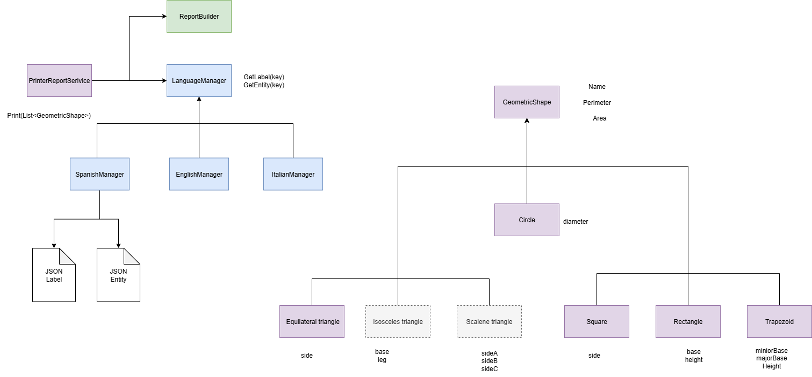

# GeometricShapes

## Explicación de la solución

- La solución está pensada completamente en backend y se dividio el requerimiento en dos partes relacionadas.

### Diagrama

---

### RF1: Creación de nuevas formas
- Se refactoriza la clase `FormaGeometrica` y se dividen las responsabilidades.
- Se usó **herencia** en lugar de interfaz para evitar que, cada vez que se quiera armar un reporte, se tengan que calcular en tiempo de ejecución el área y el perímetro.
- Se crean las clases `Trapecio` y `Rectángulo` como formas distintas, ya que pueden tener validaciones internas diferentes.
- Se aplicó **DDD** para encapsular la creación de las formas. De esta manera, evitamos efectos colaterales y la creación de formas cuyos perímetros o áreas no se puedan calcular.
- Para crear una nueva forma, solo se requiere heredar de `GeometricShape` e implementar las validaciones de su construcción.

---

### RF2: Impresión del reporte en varios idiomas
- Se implementa un servicio de impresión separado de `FormaGeometrica`.
- Internamente, el servicio construye el reporte utilizando un `ReportBuilder` y puede implementar distintos idiomas mediante el uso de `LanguageManager`.
- Se implementó una versión usando **JSON** para obtener las entidades y las etiquetas del reporte. Sin embargo, también podría persistirse en una base de datos u otros soportes externos a la aplicación, siempre que se implemente `ILanguageManager`.
- Esta estrategia permite tener un control total sobre las palabras que se muestran en la aplicación.
- Agregar un nuevo idioma implica agregar nuevos archivos JSON y completar la información, para luego ser utilizados por el `PrinterReportService` que lo requiera.

---

### Comentarios extra
- Tengo la costumbre de escribir el código en inglés, así que, salvo por las UT, todo quedó en inglés para facilitar su revisión.
- Se agregaron y modificaron **UT** existentes sobre el dominio y el servicio de impresión del reporte.
